# Troubleshooting CloudFormation Templates

## Authors 

Ed Abrahamsen, Matt Burger, Liz Mahoney, & Kishor Pandey

## Setup

There are six CloudFormation templates, each with its own bug or set of bugs that will prevent deployment from working. Start by setting up a repo containing a basic React app and the six templates:

- Create a new directory named cool-react-app to hold your work for today.
- Run create-react-app cool-react-app to create a basic React app in your directory.
- Ensure that you can run your React app locally.
- Copy all six templates (linked below) into your repo, with their unique filenames 1-6.
- Add and commit the buggy templates. (Yes, you can work on master.)
- Connect your local repo to a new GitHub repo, and push your master branch.
- Check out a new feature branch to begin work on the first template.


## Feature Tasks

Your six feature tasks are to fix each of the six broken CloudFormation templates.

As you attempt each template number in turn, follow these steps:

1. On the AWS console, create a new CloudFormation stack named coolReactApp#, where # matches the .yml file number.
2. Upload the matching template file to that new stack.
3. Attempt to finish deploying that CloudFormation stack.
4. Watch it fail.
5. Figure out why it failed. Document in your README with text and screenshots, as appropriate.
6. Fix the template to remove the bug.
7. Repeat from step 2 until the deployment is successful. Document in your README with text and screenshots, as appropriate.
8. Add, commit, push, make a PR, merge the PR.
9. Check out your master branch, pull, check out a new feature branch, start working on the next template!
10. In the end, all six templates should be fixed (i.e. be able to deploy the application).


## RoadBlocks


### Template1.yml 

***Problem 1***

In the `template1.yml`, updated Github credentials on line 5, 9 and update line 12 for github repo name

***Problem 2***

`template1.yml` there was a `Template format error` so we went into the file we did a global change on cool-react-bucket to coolReactBucket, it successfully uploaded the yaml file.


***Problem 3***

`Requires Capabilities [CAPABILITY_IAM]`

Created an appropriate `cloudformationrole` > `Adminstration` Access IAM role and it works

***Problem 4***

Back tracked During creating a new cloud formation, update github OAuth by selecting Update on Stacks console.

### Template2.yml 

***Problem 5***

In the `template2.yml`, updated Github credentials on line 5, 9 and update line 12 for github repo name


### Template3.yml 

***Problem 1***

In the `template3.yml`, updated Github credentials on line 5, 9 and update line 12 for github repo name

***Problem 2***

Error Message -  `Template error: instances of Fn::GetArr references undefined resource CodePiplineRole`

In the `template3.yml`, on line 40, 41, & 43 include `!Ref`

```
   Configuration:

        Owner: GithubOwner
        Repo: GithubRepo
        OAuthToken: GithubOAuthToken

```

Should look like below: 

```
   Configuration:

        Owner: !Ref GithubOwner
        Repo:  !Ref GithubRepo
        OAuthToken: !RefGithubOAuthToken

```

***Problem 3***

Error Message - `Template Format error: 2020-09-09 is not a supported value for AWSTemplateFormatVersion`

- Update the year of the AWSTemplateFormatVersion


***Problem 4***

`template3.yml` there was a `Template format error` so we went into the file we did a global change on cool-react-bucket to coolReactBucket, it successfully uploaded the yaml file. 


### Template4.yml 

***Problem 1***

In the `template4.yml`, updated Github credentials on line 5, 9 and update line 12 for github repo name

***Problem 2***
Error Message -  `Template error: instance of Fn::GetAtt references undefined resource CodePipelineRole`

`template4.yml` The file is missing the CodeBuildRole from Line 62-110, so that was added from previous yaml file

***Problem 3***

Error Message -  `Template error: instance of Fn::GetAtt references undefined resource CodePipelineRole`

On line 100 change `ServiceRole: !GetAtt CodePipelineRole.Arn` to `ServiceRole: !GetAtt CodeBuildRole.Arn`


### Template5.yml 

***Problem 1***

In the `template5.yml`, updated Github credentials on line 5, 9 and update line 12 for github repo name

***Problem 2***

Added a `-` on line 195 under `DistributionConfig:` > `Origins:`


***Problem 3***
 
Error message: 

```
Pipeline should start with a stage that only contains source actions (Service: AWSCodePipeline; Status Code: 400; Error Code: InvalidStructureException; Request ID: 63f78493-07eb-4e7a-85a7-adb18f0d7588)

```

Line 32  `Category: Build` to `Category: Source`


***Problem 4***

Line 135 update  `- "s3:Object"` to `- "s3:PutObject"`


***Problem 5***

Line 174 update `- aws s3 cp --acl public-read ./build s3://${coolReactBucket}/` to `- aws s3 cp --recursive --acl public-read ./build s3://${coolReactBucket}/`


### Template6.yml 

***Problem 1***

In the `template6.yml`, updated Github credentials on line 5, 9 and update line 12 for github repo name

***Problem 2***

Error Message - `Template Format error: 2020-09-09 is not a supported value for AWSTemplateFormatVersion`

- Update the year of the AWSTemplateFormatVersion


***Problem 3***

Line 7 and 10 change GithubOwner to Repo and GithubRepo to Owner


***Problem 4***
Line 82 change `Effect: Deny` to `Effect: Allow`


***Problem 5***

On line 98 change the uppercase letters `CL` to `cl`,  
From `- "s3:PutObjectACL"` to `- "s3:PutObjectAcl"`

***Problem 6***


From line 100 - 101, change `cool-react-bucket` to `coolReactBucket`


***Problem 7***

Typo Error on line 121

```

Change `- "codepipeiine.amazonaws.com"` to - "codepipeline.amazonaws.com"

```

***Problem 8***

On line 164 change from `prebuild:` to `pre_build:`


***Problem 9***

On line 172, change `postbuild:` to `post_build:`


***Problem 10***

Between lines 174-176 update `cool-react-bucket` to `coolReactBucket`

***Problem 11***

On line 185 change `cool-react-bucket:` to `coolReactBucket`


***Problem 12***

On line 196 - 197 change `cool-react-bucket:` to `coolReactBucket`

***Problem 13***

On line 207 change `cool-react-bucket:` to `coolReactBucket`

***Problem 14***

On line 208 change `"redirect-to-http"` to `"redirect-to-https"`

## Screen shots

### Template1.yml 
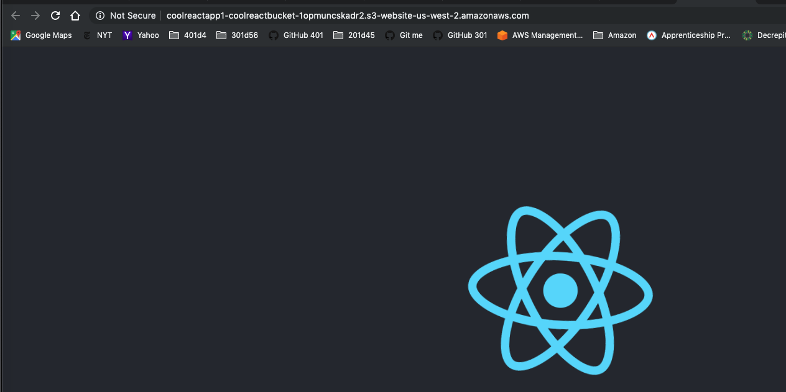

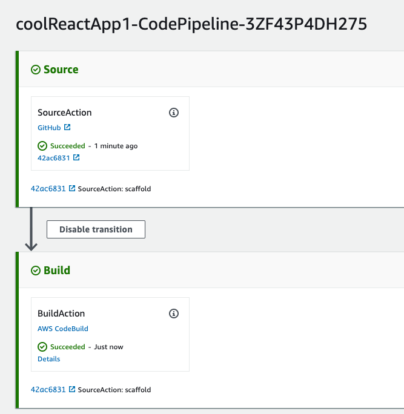
***

### Template2.yml
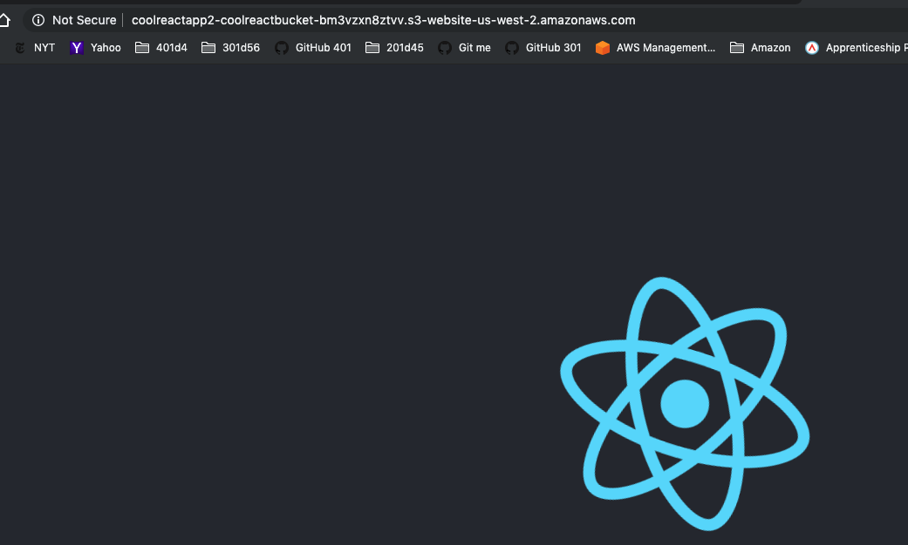

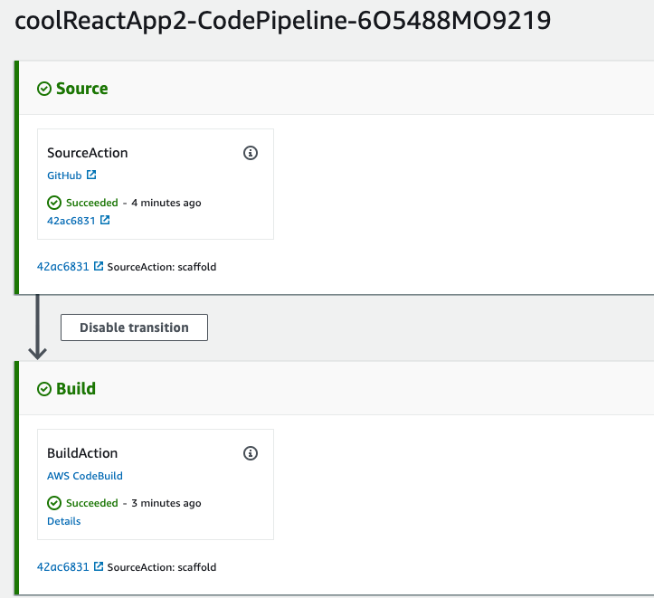
***

### Template3.yml 
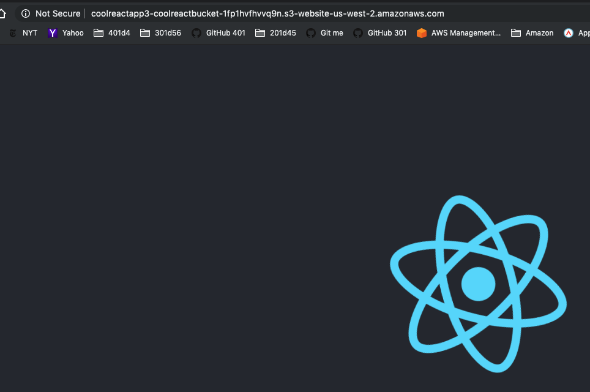

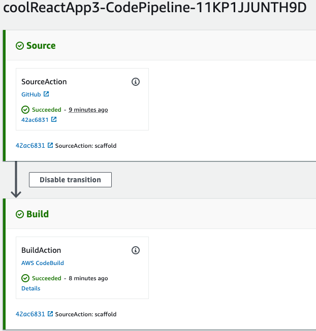
***

### Template4.yml 
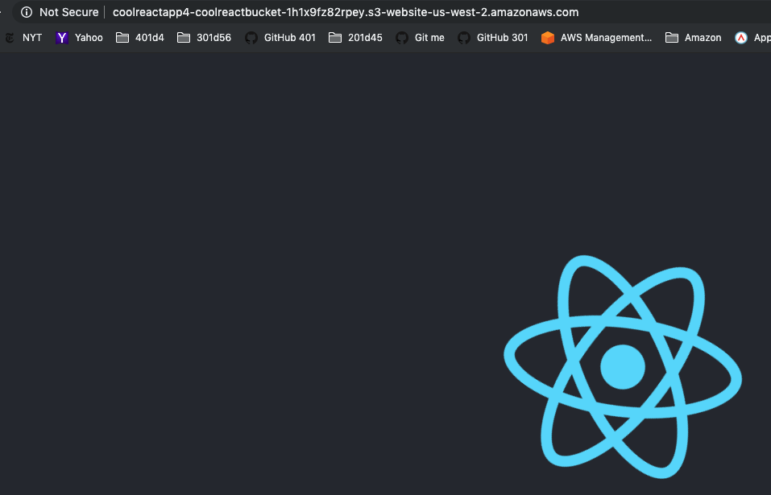

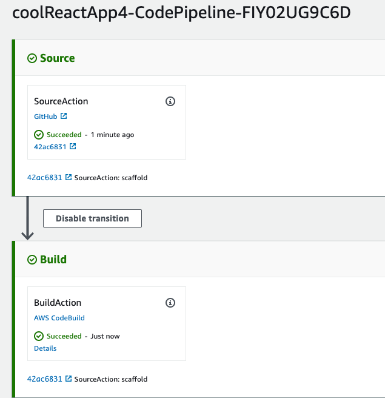

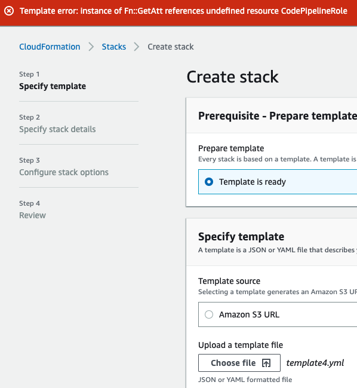

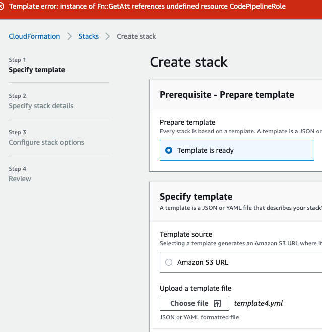
***

### Template5.yml 
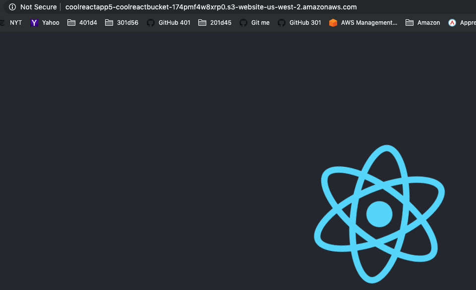

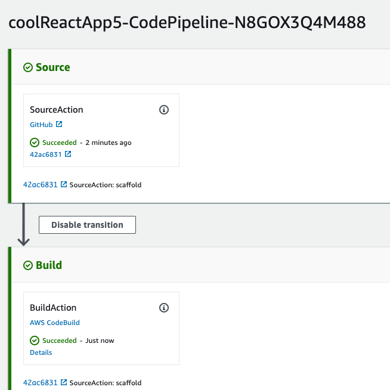

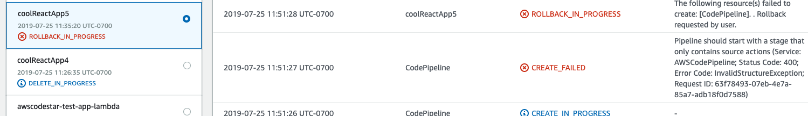
***

### Template6.yml 
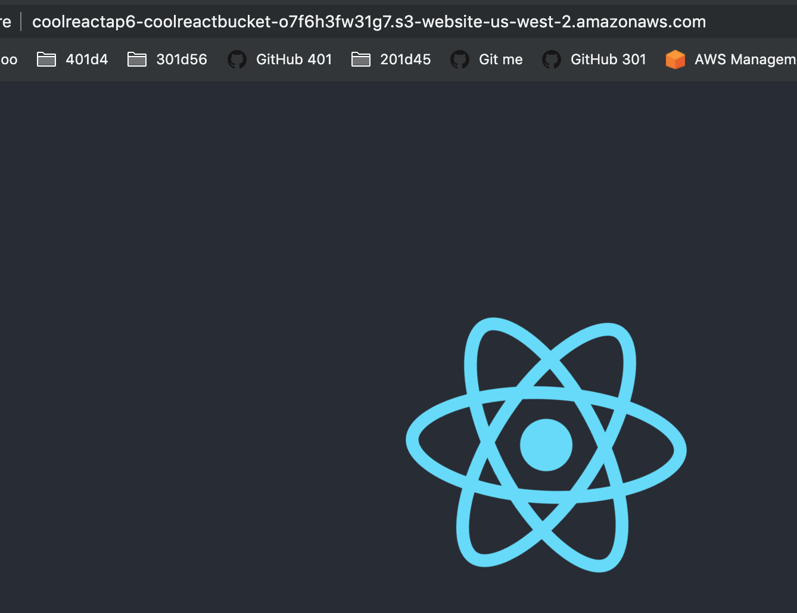

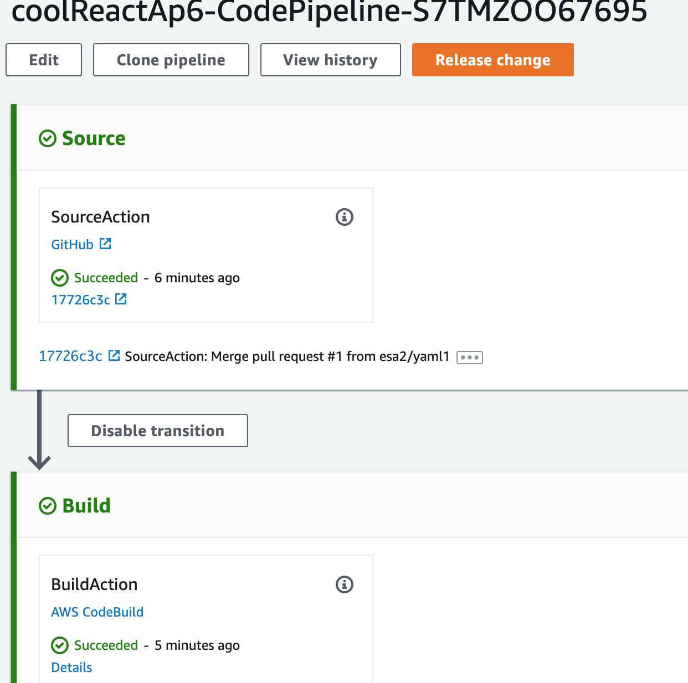

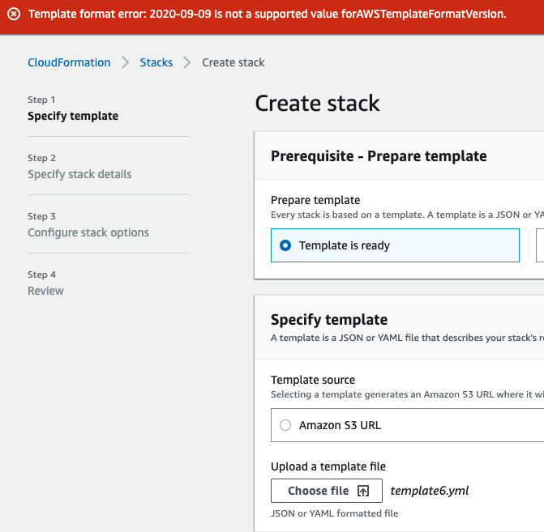
